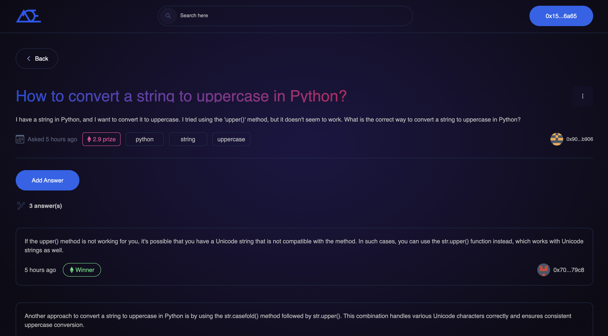

# **DoubtEarn: A Decentralized Answer-to-Earn Platform** 💡💰

**DoubtEarn** is a decentralized Q&A platform built on the **BNB Smart Chain**, enabling users to earn cryptocurrency by answering questions. 🚀

This platform allows users to:

1. Post questions with a **bounty reward** for answers.
2. Incentivize experts and enthusiasts to provide valuable answers.
3. Automate payments using smart contracts to ensure trust and transparency.

**Think of it as a blockchain-powered DoubtNut!** 🤔✨

---

## **🌟 Features**

### **1. Create Questions**

Users can post questions on the platform, specifying:

- The **question content**.
- The **reward amount** (in BNB) for the answer.
- A time frame for accepting answers.

### **2. Answer to Earn**

Other users can view the posted questions and provide answers. If their answer is accepted, they will automatically receive the specified reward directly in their wallet.

### **3. Decentralized Payments**

Payments are securely handled by a smart contract deployed on the BNB chain, ensuring trust between users.

### **4. Transparent System**

All questions, answers, and transactions are recorded on the blockchain, providing a transparent and tamper-proof system.

### **5. User-Friendly Interface**

Built with **Next.js** and **Tailwind CSS**, the platform offers an intuitive and responsive interface for smooth user interaction.

---

## **⚙️ Technologies Used**

This project leverages the following technologies:

- **BNB Smart Chain**
- **Next.js**
- **TypeScript**
- **Tailwind CSS**
- **Solidity** (Smart Contracts)
- **Hardhat** (Development Framework)
- **Ethers.js** (Blockchain Interactions)
- **MetaMask** (Wallet Integration)

---

## **🚀 How It Works**

### **1. Posting a Question**

A user creates a question, specifying:

- **Details**: What the question is about.
- **Bounty**: The reward amount (in BNB) for providing the answer.
- **Recipient Criteria**: Ensures only the best answer is accepted.

### **2. Answering the Question**

- Other users browse questions and submit answers they believe will be accepted.
- Answers are recorded on the blockchain for transparency.

### **3. Accepting an Answer**

- The question creator reviews the answers and accepts the best one.
- The specified bounty is automatically transferred to the answer provider's wallet using a smart contract.

---

## **🌐 Running the Project**

Follow these steps to set up and run **DoubtEarn** locally:

### **1. Prerequisites**

Ensure you have the following installed:

- [Node.js](https://nodejs.org/)
- [Yarn](https://yarnpkg.com/)
- [MetaMask](https://metamask.io/) wallet configured for the **BNB Testnet**.

---

### **2. Installation**

1. Clone the project repository:

   ```bash
   git clone https://github.com/gola-k/DoubtEarn_bnb.git
   cd DoubtEarn
   ```

2. Install dependencies:

   ```bash
   yarn install
   ```

3. Create a `.env` file and add the following configuration:

   ```sh
   NEXT_APP_RPC_URL=https://bsc-dataseed.binance.org/
   ```

4. Deploy the smart contract using **Hardhat**:

   ```bash
   yarn hardhat run scripts/deploy.js
   ```

5. Start the development server:
   ```bash
   yarn dev
   ```
   The app will run at **[http://localhost:3000](http://localhost:3000)**.

---

## **📸 Screenshots**

### **1. Questions List**


<center><figcaption>Browse questions posted by users.</figcaption></center>

### **2. Creating a Question**



<center><figcaption>Post your question and specify the bounty.</figcaption></center>

### **3. Question Details**


<center><figcaption>View question details and submit answers.</figcaption></center>

---

## **Useful Links**

- 🏠 [Official Mainnet Website](https://doubt-earn.vercel.app/)
- 🏠 [Official Testnet Website](https://doubtearn.netlify.app.com)
- 💡 [Pitch Deck](https://gola-k.github.io/DoubtEarn/PITCHDECK)
- 🎥 [Demo Video](https://www.youtube.com/watch?v=RTAlBB-keAU)
- 🚀 [MetaMask Wallet](https://metamask.io/)
- ⚡ [BNB Smart Chain](https://www.bnbchain.org/)
- 💡 [Hardhat Documentation](https://hardhat.org/)
- 🔥 [Next.js Documentation](https://nextjs.org/)
- 🐻 [Solidity Documentation](https://soliditylang.org/)
- 👀 [Ethers.js Documentation](https://docs.ethers.io/v5/)

---

## **🤝 Contributing**

We welcome contributions to improve **DoubtEarn**! 🎉

1. Fork the repository.
2. Create a new branch.
3. Implement your changes and commit them.
4. Open a pull request for review.

---

## **✨ Future Enhancements**

- **Rating System**: Users can rate questions and answers.
- **Search and Filter**: Find questions based on topics or bounties.
- **Multi-Currency Support**: Allow bounties in other cryptocurrencies.
- **Mobile App**: Build a mobile-friendly version for broader accessibility.

---

## **📧 Support**

Have questions or need assistance?  
Feel free to reach out at **[kunalgola9930@gmail.com](mailto:kunalgola9930@gmail.com)** or open an issue in the repository.

---

### Built with ❤️ and powered by the **BNB Smart Chain**!
